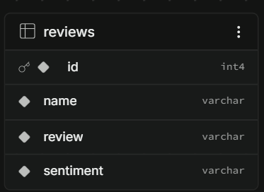
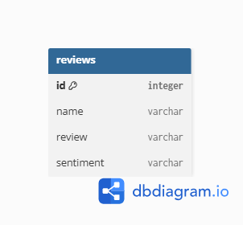

# AIVORA AI – AI-Powered Guest Review & Booking System

AIVORA AI is an AI-powered guest review and accommodation discovery platform designed to help users find suitable homestays and accommodations across Uttarakhand, explore accommodation details, read guest reviews, and analyze reviews using AI-powered sentiment analysis.

---

## 🚀 Live Demo

🔗 **Live App:** `https://yourapp.vercel.app`

> The live Vercel URL will be added after final deployment.

---

## 📸 Screenshots

### Home / Landing Page



### Accommodation Search



### Dashboard


### Hotel Details & Reviews


> Add the final 3–4 screenshots to the repository and update the image paths above if their filenames are different.

---

# ✨ Features

- 🔐 User registration and login
- 🔑 JWT-based authentication
- 📱 Login using email or phone number
- 🏨 Browse accommodations across Uttarakhand
- 🔎 Search accommodations by destination
- 🏡 View accommodation details
- ⭐ View accommodation ratings and availability
- 💰 Display price per night
- 📝 Add guest reviews
- ✏️ Edit existing reviews
- 🗑️ Delete reviews
- 🔗 Associate reviews with specific accommodations
- 👤 Automatically associate reviews with the logged-in user
- 🤖 AI-powered guest review sentiment analysis
- 😊 Positive, Neutral and Negative sentiment classification
- 📊 Review sentiment statistics
- 🔒 Protected review APIs using JWT authentication
- 📱 Responsive user interface
- 🌙 Dark-mode compatible UI
- 🔔 Toast notifications for user actions
- ⚡ Fast React + Vite frontend
- 🗄️ PostgreSQL database integration
- 🌐 REST API-based frontend/backend communication

---

# 🛠️ Tech Stack

## Frontend

- React.js
- Vite
- JavaScript
- Tailwind CSS
- React Router
- Axios
- React Hot Toast

## Backend

- Python
- FastAPI
- SQLAlchemy
- Pydantic
- JWT Authentication
- Passlib / bcrypt

## Database

- PostgreSQL
- Supabase PostgreSQL

## AI

- Google Gemini API
- Gemini-powered sentiment analysis

The AI analyzes guest review text and classifies it as:

- Positive
- Neutral
- Negative

## Deployment

- Frontend: Vercel
- Backend: Render
- Database: Supabase

## Development Tools

- Visual Studio Code
- Git
- GitHub
- Postman

---

# ⚙️ Setup Instructions

Follow the steps below to run AIVORA AI locally.

---

## 1. Clone the Repository

```bash
git clone https://github.com/1828-pseudo/Guest-Review-Sentiment-Classifier.git